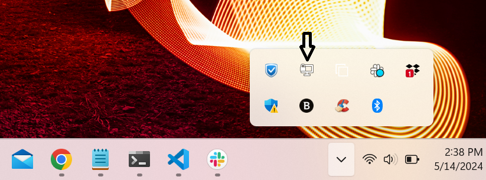
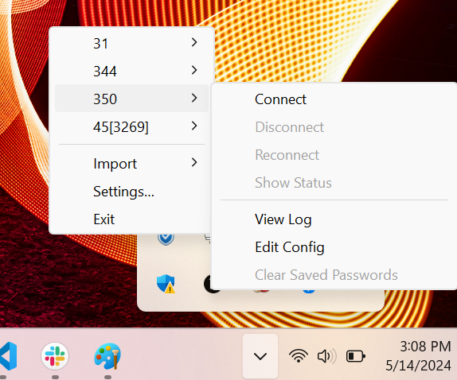

# Lab 1 - Hypervisors, Containers & Operating Systems

## Introduction
Welcome to the first lab of IT&C 344!

As the only significant assignments in this class apart from the final project, labs are designed to take several hours to complete, and as such, they should not be left to the last minute to do. You should expect to work on each lab for 10 -15 hours (5-6+ hours a week). Procrastinate these labs at your own risk!

The labs outline your objectives and give some instructions on how to proceed. However, most of the how-to-do will come from your research and diligence. You must practice your research and problem-solving skills as you would when working in IT and Cybersecurity. The labs are designed to be a beneficial learning experience, but if you cannot find a solution after working on the problem by yourself for a significant amount of time and putting in genuine effort, the TAs are there to assist you.

### Virtual Machines, Containers, and Hypervisors

A key concept for labs 1 and 2 is to understand what are **virtual machines (VMs)**, **containers**, and **hypervisors** but also the differences between them.

#### Virtual Machines

A virtual machine (VM) and a container are both methods for running applications and operating systems in a virtualized environment, but they differ in their approach to virtualization.

A virtual machine emulates an entire computer system, including the hardware, operating system, and applications. It runs on top of a hypervisor, which abstracts the underlying physical hardware and provides a virtualized environment for the VM. Each VM has its own virtual hardware, such as virtual CPU, RAM, storage, and network interfaces. VMs are typically larger than containers and require a hypervisor to be installed on the host machine.

#### Containers

A container, on the other hand, virtualizes the operating system but not the hardware. It shares the kernel of the host operating system and uses it to run applications in isolated user-space instances. Containers are smaller and lighter-weight than VMs, and they can start up faster and use fewer system resources. Multiple containers can run on the same host system, and each container shares the host's operating system kernel.

#### Hypervisors

A hypervisor, also known as a virtual machine monitor (VMM), is a software layer that enables multiple operating systems to run on a single physical host machine simultaneously, sharing the underlying physical hardware resources. The hypervisor manages the virtualized environment and provides a layer of abstraction between the physical hardware and the virtual machines running on top of it.

The hypervisor creates and manages the virtual machines, each with its own virtual hardware, including CPU, RAM, storage, and network interfaces. Each virtual machine runs its own operating system, isolated from other virtual machines and the host operating system.

There are two main types of hypervisors:

- **Type 1**, native or bare-metal hypervisors run directly on the host machine's hardware without a separate operating system. Type 1 hypervisors are often used in data centers and server environments because they provide high levels of security and performance. Examples of type 1 hypervisors include VMware ESXi, Microsoft Hyper-V, and Citrix XenServer.

- **Type 2**, or hosted hypervisors, run on top of a host operating system and are typically used on desktop or laptop computers. Type 2 hypervisors are less efficient than type 1 hypervisors because they require the host operating system to provide resources to the virtual machines. Examples of type 2 hypervisors include Oracle VirtualBox and VMware Workstation.

This lab will involve working with a type 1 hypervisor and virtual machines. Most of the labs in this class will build off each other. Please Don't delete your previous work and try not to fall behind. We will inform you when you no longer need an operating system. 

## Lab Technologies

After this lab, you will have installed or worked with

- Type 1 Hypervisor
    - Proxmox VE  

- Operating Systems
    - Windows 7
    - Windows 10
    - Windows 11
    - Windows Server 2022 - GUI version
    - Ubuntu Desktop 23.04 or 23.10
    - Ubuntu Server 22.04
    - Arch Linux
    - Fedora Linux

# Instructions

## Scenario
You have just been hired as a Cybersecurity intern specializing in operating system management. Congratulations! Your first assignment is to set up a virtualized environment for play-testing common operating systems. Jim (your Boss) has already set up a Proxmox machine (type 1 hypervisor) for you to use. He wants you to create and deploy VMs of the OSs listed in step 2.

### Step 1: Hypervisor login

You should have received VPN credentials to access the network containing your Proxmox instance. It will be an OVPN file.
To use the VPN credentials: 
- First, download the OpenVPN client. 
- Now, ensure that the GUI is open. It will appear as an icon in your toolbar.
     
    
     
    
    Figure 1 shows the toolbar OpenVPN client on Windows 

- Next, import the provided OVPN file.
- Now connect to the VPN
     
    
     
    Figure 2 Shows how to connect to the network

- Finally, visit the website link sent with your VPN credentials. After Logging in you will be greeted by a pop-up `No valid subscription`.
 Ignore it and press ok. We are using the free license and do not need to subscribe.
     
    
     
    Figure 3 shows the pop-up you should ignore

> Disclaimer: Do not change the root password and do not remove the SSH key. If you change or remove either of these, we cannot deploy VMs to your Proxmox in later labs.

### Step 2: VMs

VMs you need to install on Proxmox:

- 1 x Windows 7
- 1 x Windows 10
- 1 x Windows 11
- 1 x Windows Server 2022 - GUI version
- 1 x Ubuntu Desktop 23.04 or 23.10
- 1 x Ubuntu Server 22.04
- 1 x Arch Linux
- 1 x Fedora Linux

We will provide you with most of the ISOs. You will have to find ISOs for Windows 10, Arch Linux, and Ubuntu Desktop. For your own sanity and safety use official sites.

> Note: An ISO file is a binary image of a CD, DVD, or Blu-ray disc. They are commonly used as installation media since you can boot a VM and install an OS from an ISO file. The file appears like a physical drive to the virtual machine. For installing on a real computer, you can burn an ISO to a physical disc or copy it to a flash drive.
> Note: You will want to create local users for all Windows machines 

We will provide you with a range of IP addresses for your VMs. You will need to statically define the IP addresses of each VM to access the internet. Your subnet mask and default gateway will be as follows.

Your Subnet mask: `255.255.248.0` 
 
Your default gateway: `172.16.24.1`
Your DNS : `172.16.24.1`

> Hint: There is a way to install Windows 11 without internet

Don't try running all these VMs simultaneously; it's unlikely your machine has the resources to do it, but make sure that each VM has the resources necessary to run without struggling.

#### Screenshots
For each OS take a screenshot of the OS information and the IP address of the device.
    - For example in Windows open `System Info` and a PowerShell terminal to display your IP address.
    - For the Ubuntu server run `lsb_release -a` and `ip a` 

### Step 3 - Write Up

Answer the questions using one of the `Write Up` templates. Include all necessary screenshots.


We use HTML here for the links because if you use MarkDown, then Jekyll will convert a link to a .md file into a link to a rendered .html file.

* <a href="Lab-1-Write-Up.docx" download>Click here to download the write up template in MS Word .docx format</a>
* <a href="Lab-1-Write-Up.md" download>Click here to download the write up template in MarkDown format</a>

Regardless of which template you use, **Please submit your writeup in .pdf format!**

There are many ways to convert from MarkDown to PDF including some online tools. Among the most convenient is the [yzane Markdown PDF Add-In for VS Code](https://marketplace.visualstudio.com/items?itemName=yzane.markdown-pdf).

## Helpful links

## Requirements

[ ] 10 Points - Installed a working VM running Windows 7  
[ ] 10 Points - Installed a working VM running Windows 10  
[ ] 10 Points - Installed a working VM running Windows 11  
[ ] 10 Points - Installed a working VM running Windows Server 2022 - GUI version  
[ ] 10 Points - Installed a working VM running Ubuntu Desktop 23.04   
[ ] 10 Points - Installed a working VM running Ubuntu Server 22.04  
[ ] 10 Points - Installed a working VM running Arch Linux  
[ ] 10 Points - Installed a working VM running Fedora Linux  
[ ] 20 Points - Write up  

## Submission
Create a single PDF from one of the given `Write Up` templates that contains your written report and images showing that each requirement has been met. Upload the **PDF** to Learning Suite. *No other file format will be accepted.*

* If you use the .docx template, edit your writeup in Microsoft Word or Google Docs and use the **export to .PDF function.**
* If you use the MarkDown template, the [Markdown PDF VS Code add-in](https://marketplace.visualstudio.com/items?itemName=yzane.markdown-pdf) is among the better options. Regardless, make sure the method you use includes your images.
