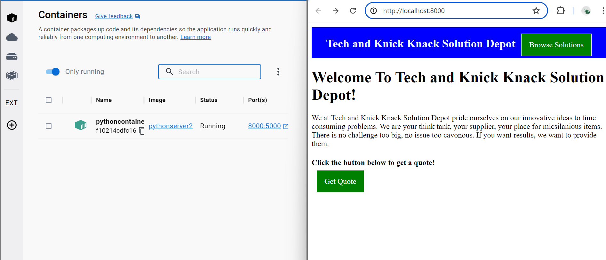

# Lab 2 - Containers

## Introduction

You have already had some exposure to virtualization in the last lab. This lab aims to strengthen your understanding of containerization. In this lab you will learn about two forms of containerization: operating system containers, and application containers.

#### Containers

As a review, A container virtualizes the operating system but does not virualize hardware. It shares the kernel of the host. Containers are smaller and lighter-weight than VMs, and they can start up faster and use fewer system resources. Multiple containers can run on the same host system, and each container shares the host's operating system kernel.

#### Operating System Containers

Operating system containers allow another operating system to use the host kernel. These kind of containers are general purpose, meaning you can interact with them like you would a regular OS. They come with a file system and terminal. LXC containers are open source linux containers. The templates to create LXC containers are included in most Linux distros.

#### Application Containers

Application containers like Docker are designed to virtualize services for particular applications. Application containers include an operating system, but the OS is only a vehicle for the intended application. Application containers are valuable because they make a service avaliable and portable. 


## Lab Technologies

After this lab, you will have worked installed or worked with

- Operating System Container

- Application Container
    - Docker Desktop
    - Docker Hub


<div style="page-break-after: always"></div>

# Instructions

## Senario 
Your boss tells you the web dev team has come up with a new website. They believe it is ready for deployment but want feedback from other parts of the company. In production the company deploys websites via Docker images on a VM. Your boss want you to set up a new low-weight testing environment in proxmox for the website. He wants you to build a LXC container. The site itself should be secure but as a precaution he wants you to ensure that you create an unprivileged LXC container. He also wants you to build the docker image and document the process. The company lost their last employee fluent in Docker.

Before leaving, you boss sends you a document the last Docker guy left.

{::options parse_block_html="true" /}

<div style="border: 1px solid #808080; margin: 1em; padding: 0.5em;" markdown="1">

Understanding Fundamentals of Docker

Docker is a useful tool that allows the deployement of webservers and other services in a way that is portable.
It's amazing but the general organization of images, containers, Dockerfiles, and docker-compose.yaml files can be confusing.
This document aims to clarify the general structure and use of the previously mentioned items.

Docker containers are the goal. Containers are live implementation of a service on a contained OS. They can be created, stopped, started, or deleted. 

Docker images are the templates to create Docker containers. The image contains information for a future container. It contains details of the OS to use and the tools avaiable to it.
There are many preconfigured Docker images that you can use as a basis for projects. They are avaliable on Dockerhub. Dockerhub is a site that you can pull images from and upload your own images
for later deployment.

A Dockerfile is useful for building a custom image. In a dockerfile you have the ability to choose a base operating system, install tools and applications, and execute commands 
on the OS to further configure settings.  

Docker compose files use yaml to manipulate Docker images to create and destroy docker containers. They are an easy alternative to commandline arguments.
Compose files can also use Dockerfiles to create Docker images.

</div>


Your boss also emails you a link to the source code to the website which uses Python as the host. [This is that link to the source code.](Lab2SiteSource.zip)

The web dev team also left you a note that the only non-standard dependencies needed for the python server to run are flask and dotenv.

### Step 1: Install a Linux Container on Proxmox

Read offical documentation on proxmox containers [here](https://pve.proxmox.com/wiki/Linux_Container#pct_container_images).
Proxmox has access to LXC templates. You may use the command line or GUI to install one of your choosing.

- First, install a template.
- Next, create a new LXC container (CT).
- Now, install Docker. 
    There are a few different packages for docker depending on the operating system you choose.
    Review these two sites to help you decide which to use.

    https://octopus.com/blog/difference-between-docker-versions#:~:text=The%20docker.io%20and%20docker,a%20package%20provided%20by%20Docker.
    
    https://superuser.com/questions/784258/whats-the-difference-between-docker-io-and-docker

- Finally, test that docker is working and take a screenshot with the ip address and result.
    Enter the following command to test if docker is working.
    ```sh
     docker run hello-world
     ```
    You may also run the following command to run an apache2 server on port 80.
    ```sh
    docker run -d  --name my-apache-app -p 80:80 -d httpd:latest
    ```

<div style="page-break-after: always"></div>

### Step 2: Create a Docker Container
There are a few different ways to create docker images, many of them are difficult but this guide will help you. It contains a similar process that we will follow. https://docs.docker.com/compose/gettingstarted/

Tips:
- The terminal is your best friend
- Remember that your website will run on `HTTP`, not `HTTPS`
- You can specify which port number the container will use
- Sudo permissions may be required to run Docker commands
- Ensure you take notes on how to make a Docker container from steps 2.2 - 2-4

### Step 2.1 - Installation
Configure your local machine as a development environment. On your local machine install Docker Desktop.
 After installation make sure you can run hello-world.

```sh
docker run hello-world
```

### Step 2.2 - Create a Dockerfile
Take a look at this [guide](https://docs.docker.com/compose/gettingstarted/). It will help you and includes a good example to work from. Remember to check the specs the web development team gave you. Take a screenshot of your finished Dockerfile.


### Step 2.3 - Create Image with Dockerfile
Look up the docker commands for this.

### Step 2.4 - Create Container from Image
Create the Container for your new image. You can do this using docker commands or using a Docker-Compose file. Test to make sure that your container runs properly and you are able to visit the website.
<br/>

Take a screenshot with DockerDesktop on one side of the screen and your website on the other. The DockerDesktop side should show the columns `Name`, `Image`, `Status`, `Port(s)`. The broswer should show the port number. The following is an example.

{: style="width: 90%;"}

### Step 3 - Upload Your Image to DockerHub
You will have to create an account then upload your image. Take a screenshot of your image in Dockerhub.

### Step 4 - Pull Down Docker Image and Create Container in Your Linux Container
You can pull down the Docker Image and create a container in the commandline or use a Docker-Compose file.
If you created a compose file in step 2.4 you should be able to reuse it.
Take a screenshot of the running container and the website pulled up on a browser

### Step 5 - Write Up

Answer the questions using the `Write Up` file provided and include all necessary screenshots. There should only be one screenshot for each title in the document.

## Helpful links

[Creating and managing a Docker Image](https://www.dataset.com/blog/create-docker-image/)
<br/>

[Contains information on how to use a Dockerfile](https://docs.docker.com/get-started/02_our_app/)

[Dockerfile syntax and best practices](https://docs.docker.com/develop/develop-images/dockerfile_best-practices/)

[How docker compose can be used to create a docker image and information on how to create a Dockerfile](https://docs.docker.com/compose/gettingstarted/)


<div style="page-break-after: always"></div>

## Requirements
[ ] 10 Points - Install a LXC   
[ ] 20 Points - Create working docker image     
[ ] 20 Points - Docker image uploaded to DockerHub  
[ ] 20 Points - Webserver docker image runs on LXC  
[ ] 30 Points - Writeup

## Submission
Create a single PDF from the given `Write Up` file that contains your written report and screenshots showing that each requirement has been satisfied. Upload the PDF to Learning Suite.